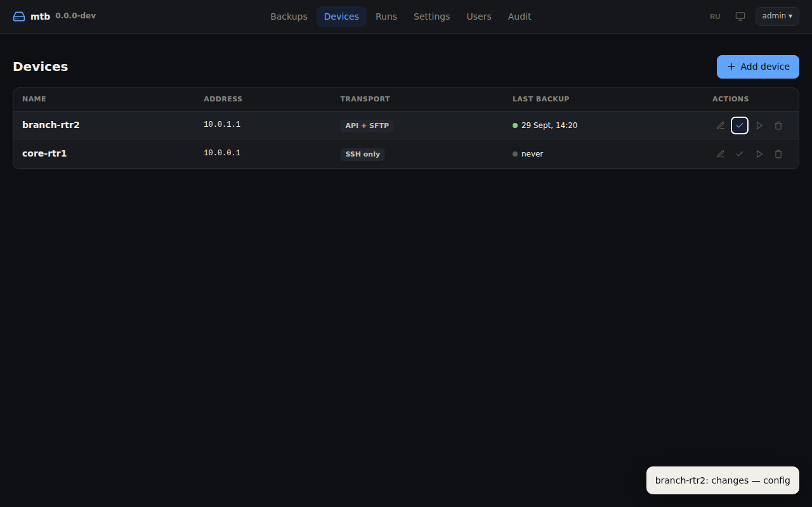
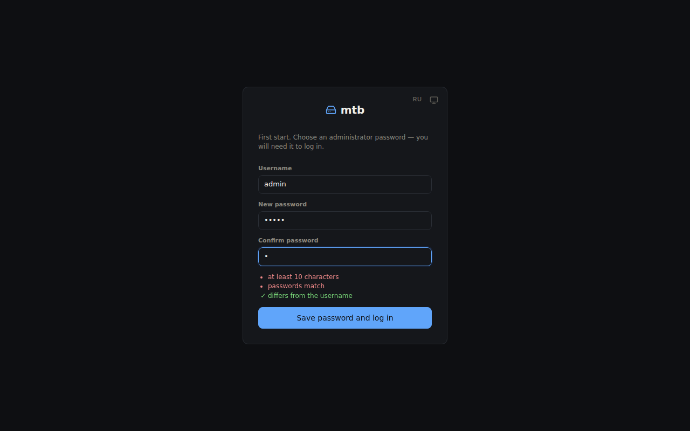
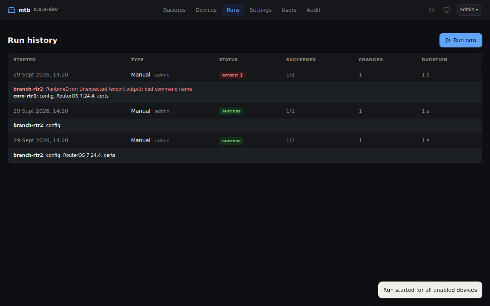
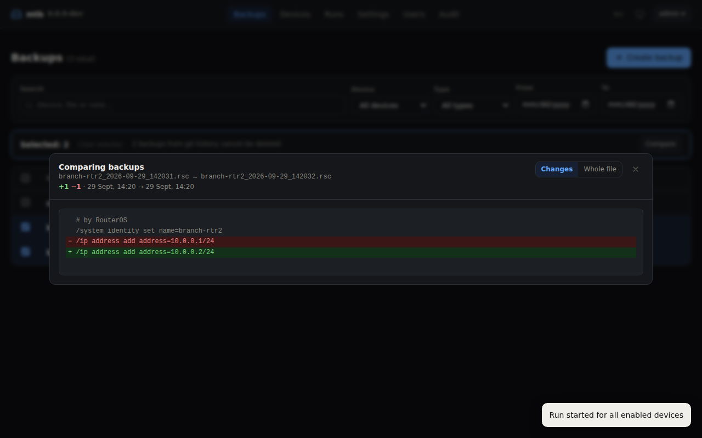

# mtb

**English** | [Русский](README.ru.md)

> 📖 **The primary, most detailed documentation is in Russian: [README.ru.md](README.ru.md).** This English version covers the same content.

A service for daily backups of MikroTik RouterOS 7 devices, with a web interface. Each run collects:

- a text configuration export **including passwords and keys**;
- an encrypted binary backup;
- certificates with their private keys.

Everything is configured in the browser: devices, schedule, storage, Gitea, Telegram and users. Settings live in SQLite, with device passwords and tokens encrypted. Backups are stored in a folder, either as current state with git history or as dated snapshots, and pushing to a self-hosted Gitea is optional.

It ships as a single binary on GitHub Releases (Linux amd64/arm64) and as a Docker image. No Python, no external database and no CDN are needed, so it also works in air-gapped networks.



## Features

- **Export** via `/export show-sensitive terse`: every line is a complete command, which keeps diffs readable.
- **Binary** `/system backup save` with a password, for a one-to-one restore.
- **Certificates** with a private key are exported as `.p12` or PEM, plus an index of all certificates.
- **Three transports**, chosen per device: API-SSL + SFTP, API-SSL only, or SSH only. In SSH mode the config is read from `/export` output, so no files are created on the router.
- **Storage:** current state with git history, or a dated snapshot folder per run with rotation. Pushing to Gitea is optional.
- **Web interface:**
  - backups: filters, preview, comparing two copies, manual backup, delete, restore;
  - devices, with access and transport checks;
  - run history, settings, users with roles, audit log.
- **First login:** an `admin` user is created, and you choose its password on the first login.
- **English and Russian interface**, with a light, dark or system theme.
- **Telegram notifications** on errors and changes.
- **Updates:** the UI shows the version, the service announces new GitHub releases and updates in one click.

## Contents

- [Quick start](#quick-start)
- [How it works](#how-it-works)
- [What is stored](#what-is-stored)
- [Preparing MikroTik](#preparing-mikrotik)
- [Installation](#installation)
- [Web interface](#web-interface)
- [Device settings](#device-settings)
- [General settings](#general-settings)
- [Environment variables](#environment-variables)
- [Transport modes](#transport-modes)
- [Storage and Gitea](#storage-and-gitea)
- [Commands](#commands)
- [Restore](#restore)
- [Security](#security)
- [Backing up mtb itself](#backing-up-mtb-itself)
- [Upgrading](#upgrading)
- [Troubleshooting](#troubleshooting)
- [Development and build](#development-and-build)

## Quick start

**Docker Compose:**

```bash
mkdir -p mtb/{data,backups} && cd mtb
curl -fsSLO https://raw.githubusercontent.com/netcorexc0a8/mtb/main/docker-compose.yml
PUID=$(id -u) PGID=$(id -g) docker compose up -d
```

**Linux binary (systemd):**

```bash
curl -fsSL https://github.com/netcorexc0a8/mtb/releases/latest/download/install.sh | sudo sh
```

Then:

1. Open `http://<server>:8080`. The first-login form appears right away: the login is `admin`; choose a password and confirm it.
2. **Devices → Add device:** enter the address, RouterOS user, password and transport. For API-SSL, click "Fetch from device" to fill in the certificate fingerprint.
3. **Settings → Storage:** set the backup encryption passphrase.
4. **Runs → Run now**, or wait for the schedule (daily at 03:00 by default).



> ⚠️ Until the `admin` password is set, whoever opens the page first can set it. Do it immediately after installing. If the service is reachable from outside, do the first login through an SSH tunnel: `ssh -L 8080:127.0.0.1:8080 server`.

## How it works

On schedule, for each device:

1. Connect over **API-SSL** (8729) with TLS certificate verification, or over **SSH** (22), depending on the transport.
2. Export the configuration (`/export show-sensitive terse`), run `system backup save` with a password, and export certificates that have a private key.
3. Fetch the files over SFTP or via the API `/file/read`. In SSH mode, the config is taken directly from `/export` output.
4. Delete the temporary `mtbk-*` files from the router, including when the run fails.
5. Write the result to the backup folder as a git commit or a snapshot, and push to Gitea if configured.
6. Record the outcome in the run history, and send a Telegram message if something changed or failed.

Settings are re-read from the database before every run. Changes made in the UI, including the schedule, take effect without a restart.

## What is stored

With **git** storage (default), each device folder holds the current state, and git holds the history:

```
backups/
├── core-rtr1/
│   ├── config.rsc          # export with secrets; date header line removed
│   ├── system.backup       # encrypted with the backup passphrase
│   ├── meta.json           # identity and RouterOS version
│   └── certs/
│       ├── index.json      # all certificates: name, CN, fingerprint, expiry
│       └── vpn-server.p12  # or .crt + .key (PEM format)
└── branch-rtr2/…
```

When files are rewritten:

- `config.rsc` is rewritten only when the configuration changes; the date header line is removed.
- `system.backup` is updated together with the config.
- Certificates are updated only when their index changes.

RouterOS uses a fresh salt for `.backup` and `.p12` on every export, so rewriting them daily would bloat the history without any real change.

With **snapshots** storage, every run creates a `<device>/<YYYY-MM-DD_HHMMSS>/` folder with all files, and old snapshots are rotated out.

With "config only", there is no `system.backup` and no `certs/` in either mode.

> ⚠️ RouterOS never includes `/user` passwords in `export`, not even with `show-sensitive`. They exist only in `system.backup`.

## Preparing MikroTik

In the examples, `10.10.10.5` is the mtb server.

**1. API-SSL certificate.** Not needed with the "SSH only" transport. The key must be at least 2048 bits.

A certificate with `key-usage=tls-server` cannot sign itself, so first create a local CA, then use it to sign the API-SSL certificate:

```routeros
# local CA (self-signed)
/certificate add name=local-ca common-name=local-ca days-valid=3650 key-size=2048 \
    key-usage=key-cert-sign,crl-sign
/certificate sign local-ca

# API-SSL certificate signed by that CA
/certificate add name=api-ssl common-name=core-rtr1 days-valid=3650 key-size=2048 \
    key-usage=digital-signature,key-encipherment,tls-server
/certificate sign api-ssl ca=local-ca

/certificate print          # api-ssl should show the K and I flags; signing takes a few seconds
/ip service set api-ssl certificate=api-ssl address=10.10.10.5/32 disabled=no
```

For TLS verification in mtb, either option works:

- **Fingerprint.** Click "Fetch from device" in the device form. After `api-ssl` is reissued, you will need to update the fingerprint.
- **CA in PEM.** Export it with `/certificate export-certificate local-ca type=pem`, download `cert_export_local-ca.crt` via Winbox (*Files*) or SFTP, and paste its contents into the "Certificate / CA (PEM)" field. Verification keeps working when `api-ssl` is reissued, as long as the same CA signs it. Without `export-passphrase`, the CA private key is not exported.

**2. SSH.** Not needed with the "API only" transport.

```routeros
/ip service set ssh address=10.10.10.5/32,<your management addresses>
```

**3. Group and user.**

```routeros
/user group add name=backup policy=read,write,policy,test,sensitive,api,ssh,ftp
/user add name=backup group=backup address=10.10.10.5/32 password="<password>"
```

The minimal set of policies depends on the mode, and the device's "Check access" button shows what is missing. For example, "SSH only" + "config only" needs just `read,sensitive,ssh`.

| Policy | Why it is needed |
|---|---|
| `read`, `sensitive` | Export including passwords and keys. |
| `write`, `ftp` | Creating, reading and deleting temporary files. |
| `policy`, `test` | `system backup save` and certificates. |
| `api` / `ssh` | Connecting with the chosen transport. |

**4. Certificate fingerprint.** The "Fetch from device" button in the device form fills it in. Compare it with `/certificate print detail` on the router to rule out interception.

## Installation

### Linux binary (systemd)

The binary is self-contained and runs on glibc 2.28 or newer: Debian 10+, Ubuntu 20.04+, Astra Linux 1.7+, RHEL/Alma 8+. The host needs `git` for git storage and Gitea push.

```bash
curl -fsSL https://github.com/netcorexc0a8/mtb/releases/latest/download/install.sh | sudo sh
# a specific version:
curl -fsSLO https://github.com/netcorexc0a8/mtb/releases/latest/download/install.sh && sudo sh install.sh v0.1.0
```

What the script does:

- verifies the binary against `SHA256SUMS` and installs it to `/opt/mtb/mtb`, with a `/usr/local/bin/mtb` link. The file is owned by the service user so that mtb can update itself from the web UI;
- creates the `mtb` system user and `/var/lib/mtb/{data,backups}` with mode 0700;
- installs and starts `mtb.service`.

Optional startup variables go in `/etc/mtb/mtb.env`. Logs: `journalctl -u mtb -f`.

**Manually, in any folder:**

```bash
curl -fsSLo mtb https://github.com/netcorexc0a8/mtb/releases/latest/download/mtb-linux-amd64
chmod +x mtb && ./mtb
```

The database and backups are created in `./data` and `./backups`.

### Docker Compose

The `ghcr.io/netcorexc0a8/mtb` image is built for linux/amd64 and linux/arm64.

```bash
mkdir -p mtb/{data,backups} && cd mtb
curl -fsSLO https://raw.githubusercontent.com/netcorexc0a8/mtb/main/docker-compose.yml
echo "PUID=$(id -u)" > .env && echo "PGID=$(id -g)" >> .env
docker compose up -d && docker compose logs -f
```

| Host path | In container | Purpose |
|---|---|---|
| `./data` | `/data` | SQLite, secret encryption key, `known_hosts`. |
| `./backups` | `/backups` | Backups. |

The port is published on `127.0.0.1:8080`. Expose it only through a reverse proxy with TLS, and set `WEB_COOKIE_SECURE=true`. The image HEALTHCHECK polls `/healthz`.

Without Compose:

```bash
docker run -d --name mtb --restart unless-stopped --init --user "$(id -u):$(id -g)" \
  -p 127.0.0.1:8080:8080 -v "$PWD/data:/data" -v "$PWD/backups:/backups" \
  ghcr.io/netcorexc0a8/mtb:latest
```

## Web interface

**Language and theme.** Buttons in the header and on the login page:

- **RU / EN** switches the interface language. Server messages (errors, run history, check results) come in the chosen language too.
- **The theme** cycles through system → light → dark.

The default language is English. The chosen language is stored in the user profile, so it is the same in any browser and at any address of the service; the login page uses the last choice made in that browser. The theme is remembered in the browser and follows the system by default.

| Section | Contents | Who can use it |
|---|---|---|
| **Backups** | Filtered list, preview, comparing two copies, downloading any file of a backup, manual backup, delete, restore. | Everyone: view and download. Admins: everything else. |
| **Devices** | List with the last backup status. Add and edit, check access, check transports (`probe`), back up now. | Everyone: list. Admins: changes. |
| **Runs** | Run history: successes, changes, per-device errors. "Run now" button. | Everyone. |
| **Settings** | Schedule, storage and encryption, Gitea, Telegram, restore from the UI. | Admins. |
| **Users** | Admin and view-only roles, temporary passwords. | Admins. |
| **Audit** | Logins, settings and device changes, downloads, deletions, restores. | Admins. |



**Comparing backups.** Select exactly two and click "Compare". The diff always reads from older to newer. By default only changes with context are shown; "Whole file" expands the rest.



**Users and passwords:**

- On first start, `admin` is created without a password. The password (at least 10 characters) is chosen and confirmed on the first login.
- For new users, an admin issues a temporary password. On first login the user enters it and chooses their own.
- The "issue a temporary password" button resets a forgotten password and ends that user's sessions.
- You can change your own password from the user menu; this ends your other sessions.
- If the only admin's password is lost, run `mtb reset-password admin` on the server. On the next login you will be asked to set a new one.

## Device settings

Set in the form under **Devices → Add / Edit**.

| Field | Default | Description |
|---|---|---|
| Name | — | Unique: Latin letters, digits, `. _ -`. Also the name of the backup folder. On rename, the folder is moved (in git, as a separate `rename` commit) and the old name is added to "Former names". |
| Former names | — | Backups and run history under these names are shown for this device. Use it if backups were left under an old name. |
| Address, user, password | — | RouterOS access. The password is stored encrypted and never returned to the UI. |
| Enabled in schedule | yes | Disabled devices are skipped by the schedule but can still be backed up manually. |
| Transport | API + SFTP | API + SFTP, API-SSL only, or SSH only. See [Transport modes](#transport-modes). |
| Config only | no | No `system.backup` and no certificates. |
| Binary files via API | base64 | For "API only": `base64`, `raw` or "don't fetch". |
| Certificate format | auto | PKCS#12 or PEM. |
| Which certificates | all with a key | All, only the listed ones, or none. |
| TLS verification | fingerprint | SHA-256 fingerprint, your own certificate or CA in PEM, or "don't verify". Not needed for "SSH only". |
| Weak keys | no | Allow API-SSL certificates with 1024-bit keys. |
| Ports, timeout | 8729, 22, 30 s | |
| Encoding | UTF-8 | Windows-1251 if names and comments were typed in Cyrillic via Winbox. |

## General settings

The **Settings** section, admins only.

| Group | Parameters |
|---|---|
| Schedule | Cron expression (default `0 3 * * *`), time zone, how many devices to poll in parallel. Shows the next run time. |
| Storage and encryption | Passphrase for `.backup` and certificates. Mode: git or snapshots. For git: whether to keep history. For snapshots: retention, minimum kept, "only on changes". |
| Gitea | Repository URL, user, token, branch, commit author, CA in PEM, disabling TLS verification. |
| Telegram | Bot token, `chat_id`, notification language, when to send, and the message template. See [Telegram messages](#telegram-messages). |
| Updates | Whether to check GitHub for new versions, and the channel: auto, stable only, or including pre-releases. "Check now" button. See [Upgrading](#upgrading). |
| Web interface | Allow restore (`/import`) from the backup list. Off by default. |

### Telegram messages

Under **Settings → Telegram notifications** you set:

- **When to send:** on errors and changes (default), on errors only, or after every run.
- **Notification language:** English (default) or Russian.
- **Template:** a preset ("Detailed", "Short", "Errors only") or your own text, with a live preview on sample data.

Lines whose variables turn out empty (for example `{changes}` when nothing changed) are not sent. The text is sent as is, without Markdown. "Send a test message" sends the saved template with sample data.

| Variable | Value |
|---|---|
| `{icon}` | ✅ success, ⚠️ errors or warnings, ❌ all failed |
| `{title}` | `mtb` or "manual backup" |
| `{kind}` | scheduled / manual |
| `{date}`, `{time}` | run date and time |
| `{ok}`, `{total}` | devices succeeded / total |
| `{failed_count}`, `{changed_count}` | devices failed / changed |
| `{devices}` | devices in the run |
| `{changes}` | a "Changes: core-rtr1 (config); …" line, or empty |
| `{errors}` | errors, one line per device: `• rtr2: TimeoutError: …` |
| `{warnings}` | warnings (for example, about Gitea push) |
| `{version}` | mtb version |

Example of a custom template:

```text
{icon} MikroTik backup for {date}: {ok} of {total}
{changes}
{errors}
```

Secrets (the passphrase and tokens) are never sent back to the UI; you only see "set" or "not set". Leaving the field empty on save keeps the current value, and the "delete" checkbox clears it.

## Environment variables

These are only needed to start the service. Everything else is configured in the UI.

| Variable | Default | Description |
|---|---|---|
| `DATA_DIR` | `data` (Docker: `/data`) | The `mtb.db` database, `secret.key`, `known_hosts`. |
| `BACKUP_DIR` | `backups` (Docker: `/backups`) | Backup folder. |
| `WEB_LISTEN` | `0.0.0.0:8080` | Web UI address. |
| `WEB_TLS_CERT` / `WEB_TLS_KEY` | — | HTTPS without a reverse proxy. |
| `WEB_COOKIE_SECURE` | `auto` | The Secure flag on the session cookie. `auto` turns it on when `WEB_TLS_CERT` is set. Use `true` behind an HTTPS proxy. |
| `LOG_LEVEL` | `INFO` | Log level. |

They can be set in the environment, in `.env` in the working directory, or in a file passed with `-e`.

## Transport modes

| | API + SFTP (default) | API only | SSH only |
|---|---|---|---|
| Commands | API-SSL | API-SSL | SSH exec |
| Config | file → SFTP | file → `/file/read` | `/export` output, no file |
| `.backup`, certificates | SFTP | via `api_binary` | SFTP in the same session |
| Ports | 8729 + 22 | 8729 only | 22 only |
| Host verification | TLS + SSH (TOFU) | TLS | SSH (TOFU) |
| RouterOS | any 7.x | 7.13+ | any 7.x |

In "API only" mode, binary files need a workaround because the API works with strings:

- **`base64`**: the router encodes file chunks itself;
- **`raw`**: raw bytes over a `latin-1` connection;
- **"don't fetch"**: no `.backup`, and certificates are exported as PEM.

The **"Check transports"** button in the device form, the same as `mtb probe`, shows what works on a given router. It creates temporary files, reads them with every method, compares against an SFTP reference and suggests settings.

The simplest mode is "SSH only" + "config only": one SSH command per device, nothing created on the router, and only `read,sensitive,ssh` policies needed.

## Storage and Gitea

**Git** (default). The folder holds the current state and the local git repository holds the history, so `git log -p` and `git diff` work directly in `backups/`. Turning off "keep history" leaves only the latest files.

In git mode, the delete button in the list **removes the backup from the list**: commits are never deleted from git history and stay in Gitea. The confirmation says so.

**Snapshots.** Every run creates a dated folder with a full copy of everything collected.

- Snapshots older than the retention period are deleted, but the minimum number of newest snapshots is always kept, even if a router has been unreachable for a long time.
- "Only on changes" creates a snapshot only when the config, the RouterOS version or the certificates changed.
- Deleting from the UI (the button in the Actions column, or in bulk) removes the snapshot from disk in this mode.

**Gitea** (git storage only):

1. Create a private repository and a user with write access.
2. Create a token for that user under *Settings → Applications → Access Tokens* with the `write:repository` scope.
3. Enter the URL, user and token under **Settings → Gitea**.

How push works:

- The token is passed to git through environment variables and never lands in `.git/config`.
- Push runs on every run and catches up on failed earlier pushes.
- A failed push does not count as a failed backup; the run history marks it as a warning.

## Commands

```
mtb [--data-dir DIR] [-e ENV_FILE] [--log-level LEVEL] [COMMAND]

  serve                   schedule + web UI (default; alias: daemon)
  scheduler               schedule only, no web UI
  run [-d NAME ...]       single run, then exit; without -d, all enabled devices
  check [-d NAME ...]     check access and permissions without exporting
  probe [-d NAME ...] [--no-sftp]
                          test which file transport works
  fingerprint HOST[:PORT] fingerprint, expiry and PEM of the API-SSL certificate
  reset-password [USER]   reset a password (admin by default)
  -V, --version
```

Commands use the same database as the service, so pass the same `DATA_DIR`. Under systemd:

```bash
sudo -u mtb env DATA_DIR=/var/lib/mtb/data mtb check
```

In Docker: `docker compose exec mtb mtb check`.

## Restore

All files are encrypted with the backup passphrase. Upload a file to the router via Winbox (*Files*) or SFTP.

```routeros
# binary backup — same device or model; the router reboots
/system backup load name=system.backup password="<passphrase>"

# certificates
/certificate import file-name=vpn-server.p12 passphrase="<passphrase>"
/certificate import file-name=vpn-server.crt
/certificate import file-name=vpn-server.key passphrase="<passphrase>"
```

**Text export** onto a reset or different device:

1. Run `/system reset-configuration no-defaults=yes skip-backup=yes`.
2. Connect via Winbox using the MAC address.
3. Upload the certificate files and `config.rsc`.
4. Import the certificates first, because `ip service`, IPsec and other sections reference them.
5. Run `/import file-name=config.rsc`.
6. Set the `/user` passwords again.

If restore is enabled in the settings, the "Restore" button in the backup list uploads the `.rsc` over SSH and runs `/import`, showing the output in a dialog. `/import` applies the script on top of the current config, so this button is meant for a reset device or partial scripts.

## Security

- **Backups contain passwords, PSKs and private keys in plain text.** The backup folder is created with mode 0700, and the Gitea repository must be private.
- **Secrets in the database** (device passwords, the passphrase, tokens) are encrypted with `DATA_DIR/secret.key` (Fernet: AES + HMAC). The key is created on first start with mode 0600. Without it, the secrets in the database cannot be read.
- **User passwords** are stored as scrypt hashes.
- **Sessions** use an `HttpOnly` + `SameSite=Strict` cookie that lasts 12 hours and is extended while you are active.
- **CSRF:** mutating requests require an `X-Requested-With` header.
- **Brute force:** at most 10 failed logins per 15 minutes from one address.
- **Roles:** view-only users see no settings, users or audit log, and cannot change anything.
- Strict CSP, with no external scripts.
- Device passwords and tokens are never returned by the API, only a "set" flag.
- **The audit log** records logins, failed attempts, changes, downloads, deletions and restores.
- **Expose the UI only over HTTPS:** a reverse proxy with `WEB_COOKIE_SECURE=true`, or `WEB_TLS_CERT` / `WEB_TLS_KEY`.
- **The router `backup` user:** restrict it by source address, and restrict services with `address=`. Do not disable TLS verification: this account has the `sensitive` and `write` policies.
- **Self-update.** The binary in `/opt/mtb` is owned by the service user, otherwise updating from the web UI would be impossible. A new file is accepted only with a matching SHA256 from the release and after a `--version` check. If you don't want this, make root the owner (`chown root: /opt/mtb /opt/mtb/mtb`): the UI will then only show the update command.
- **The router's SSH host key** is remembered on first connection. If the key changes later, the connection is refused.

## Backing up mtb itself

Save the whole `DATA_DIR`: `mtb.db` and `secret.key` **together**. Keep the backup passphrase separately, for example in a password manager: without it, `.backup` and certificates cannot be restored.

For a live copy, use `sqlite3 mtb.db ".backup copy.db"`, or stop the service first.

## Upgrading

**The version** is shown in the header next to the logo and matches the release tag on GitHub. Clicking it opens the release notes for that version.

**Checking for new versions.** Every 6 hours (and via "Check now" under **Settings → Updates**), mtb fetches the repository's release list. If a newer version exists, a `↑ vX.Y.Z` badge appears in the header for all users. Clicking it opens a dialog with the release notes.

The **channel** controls which releases are considered:

| Channel | What is offered |
|---|---|
| auto (default) | If a pre-release is installed (`0.2.0-rc.1`, `0.1.0-dev`), both pre-releases and stable versions. If a stable version is installed, stable only. |
| stable only | Versions without a suffix only. |
| including pre-releases | All versions. |

In air-gapped networks you can turn the check off. The service needs access to `api.github.com` and `github.com`; a proxy is set with the standard `HTTPS_PROXY` / `NO_PROXY` variables.

**Updating from the web UI** works for `install.sh` installations (binary under systemd). An admin clicks "Update to vX.Y.Z", and mtb:

1. downloads `mtb-linux-<arch>` and `SHA256SUMS` for that release and verifies the checksum;
2. runs the new file with `--version` to confirm it is the expected version;
3. keeps the current binary as `/opt/mtb/mtb.prev` and atomically replaces it;
4. waits for any running backup to finish and exits, after which systemd starts the service with the new version.

The page waits for the restart and reloads itself. Every update and every failed attempt is recorded in the audit log.

**Rollback:**

```bash
mv /opt/mtb/mtb.prev /opt/mtb/mtb && systemctl restart mtb
```

**Other installation methods.** For these, the update dialog shows a ready-to-run command:

| Method | How to upgrade |
|---|---|
| systemd, manually | `curl -fsSL https://github.com/netcorexc0a8/mtb/releases/download/vX.Y.Z/install.sh \| sh -s vX.Y.Z` — the configuration and database are left alone. |
| Docker Compose | `docker compose pull && docker compose up -d`. Only stable versions get the `latest` tag; for a pre-release, set the image tag explicitly. |
| From source | `git fetch --tags && git checkout vX.Y.Z`, then restart. |

The database schema is migrated automatically on start.

## Troubleshooting

| Symptom | Fix |
|---|---|
| Lost the `admin` password | `mtb reset-password admin` with the same `DATA_DIR`. On the next login you will be asked to set a new one. |
| The login form reappears right after logging in | The UI is opened over HTTP while `WEB_COOKIE_SECURE=true`. Use HTTPS or remove the variable. |
| "Too many attempts" | 10 failed logins in 15 minutes. Wait, or restart the service. |
| `не удалось расшифровать секрет` in the server log | The database was copied without its `secret.key`. Restore the key or re-enter the passwords. |
| `FingerprintMismatch` | The API-SSL certificate was reissued. Click "Fetch from device" and verify the fingerprint. |
| `DH_KEY_TOO_SMALL`, `handshake failure` | The API-SSL key is shorter than 2048 bits. Reissue it, or enable "weak keys". |
| Missing policies | "Check access" shows which ones. |
| `BadHostKeyException` | The router's SSH key changed. If that was expected, delete its line from `DATA_DIR/known_hosts`. |
| "No backup encryption passphrase set" | Settings → Storage and encryption. |
| `UnicodeDecodeError` | Set the device encoding to Windows-1251. |
| `Permission denied` in `./data` or `./backups` (Docker) | Set `PUID`/`PGID` to the owner of the folders. |
| Push rejected | Someone committed to the repository manually. The service tries `pull --rebase`; if that hits a conflict, resolve it in `backups/`. |

For a detailed log, use `LOG_LEVEL=DEBUG`.

## Development and build

**Linux:**

```bash
git clone https://github.com/netcorexc0a8/mtb.git && cd mtb
python -m venv .venv && . .venv/bin/activate && pip install -r requirements.txt
python -m mtb serve          # http://localhost:8080, data in ./data and ./backups
```

**Windows (PowerShell).** Requires Python 3.11+ and Git for Windows.

```powershell
git clone https://github.com/netcorexc0a8/mtb.git; cd mtb
py -m venv .venv; .\.venv\Scripts\Activate.ps1; pip install -r requirements.txt
python -m mtb serve          # http://localhost:8080, data in .\data and .\backups
```

If the execution policy blocks venv activation, run `Set-ExecutionPolicy -Scope CurrentUser RemoteSigned` once.

Everything works on Windows except self-update, which targets the Linux binary under systemd. Git storage needs `git` in `PATH`, which Git for Windows provides.

**Line endings.** `.gitattributes` keeps code and scripts in LF regardless of `core.autocrlf`. Otherwise an `install.sh` committed from Windows with CRLF would not run on Linux. If your clone predates `.gitattributes`, refresh the working copy once (uncommitted changes will be lost):

```powershell
git rm -r --cached -q .; git reset --hard
```

**Binary:**

```bash
pip install pyinstaller && pyinstaller --clean --noconfirm mtb.spec
```

For compatibility with older glibc, build inside `python:3.11-slim-buster`, as CI does.

**Release** means a git tag. Push `main` first, then tag a commit that is already on GitHub:

```bash
git push origin main
git tag v0.2.0
git push origin v0.2.0
```

The tag format is `vX.Y.Z` or `vX.Y.Z-rc.1` / `vX.Y.Z-dev`, with a hyphen. Versions with a suffix are published as pre-releases and do not get `latest`. There is no need to write the version into the code: CI injects it from the tag into the binary and the image, and when running from a git clone it is taken from `git describe`. For a local image build, pass it explicitly: `docker build --build-arg VERSION=0.2.0 .`.

The workflow builds the binaries (linux-amd64, linux-arm64), publishes the image to GHCR, and creates a GitHub Release with `install.sh`, the systemd unit and `SHA256SUMS`.

### Project layout

```
mtb/
├── mtb/
│   ├── main.py          # CLI and service (schedule + web)
│   ├── config.py        # startup from environment; settings and devices from SQLite
│   ├── db.py            # SQLite: schema and migrations
│   ├── secretbox.py     # encryption of secrets in the database
│   ├── auth.py          # users, scrypt, sessions, brute-force protection
│   ├── web.py           # web server and API
│   ├── web/             # index.html, app.js, app.css, i18n.js (English dictionary, theme)
│   ├── i18n.py          # English translations of server messages
│   ├── runner.py        # a single backup run + run history
│   ├── mikrotik.py      # API-SSL, SSH, SFTP, /file/read, export, restore
│   ├── probe.py         # transport checks
│   ├── storage.py       # git / snapshots storage, Gitea push
│   ├── catalog.py       # backup index for the web UI
│   ├── updater.py       # GitHub release checks and self-update
│   └── notify.py        # Telegram
├── packaging/           # PyInstaller entry point, systemd unit
├── docs/                # screenshots
├── .gitattributes       # LF for code and scripts
├── install.sh, mtb.spec, Dockerfile, docker-compose.yml, .env.example
├── README.md            # English
├── README.ru.md         # Russian (primary)
└── .github/workflows/release.yml
```
