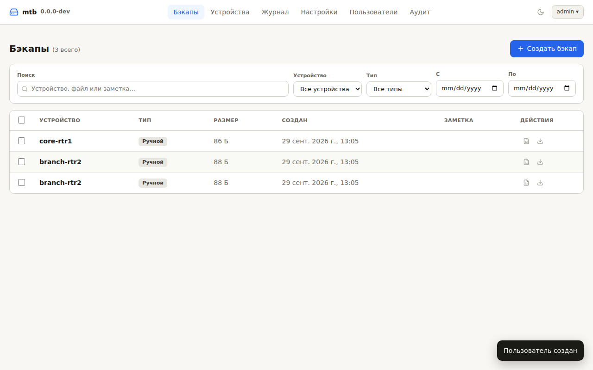
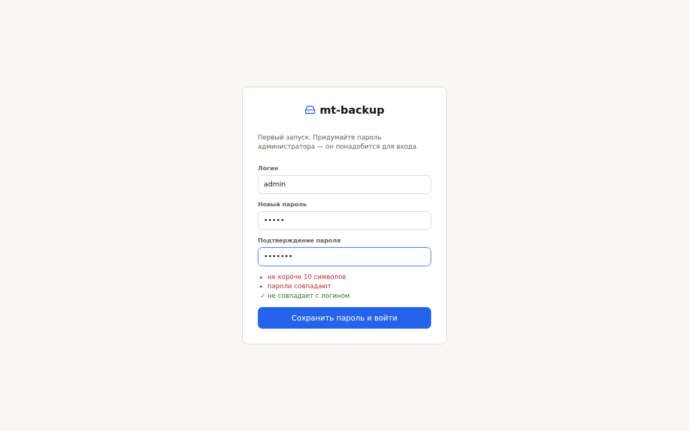
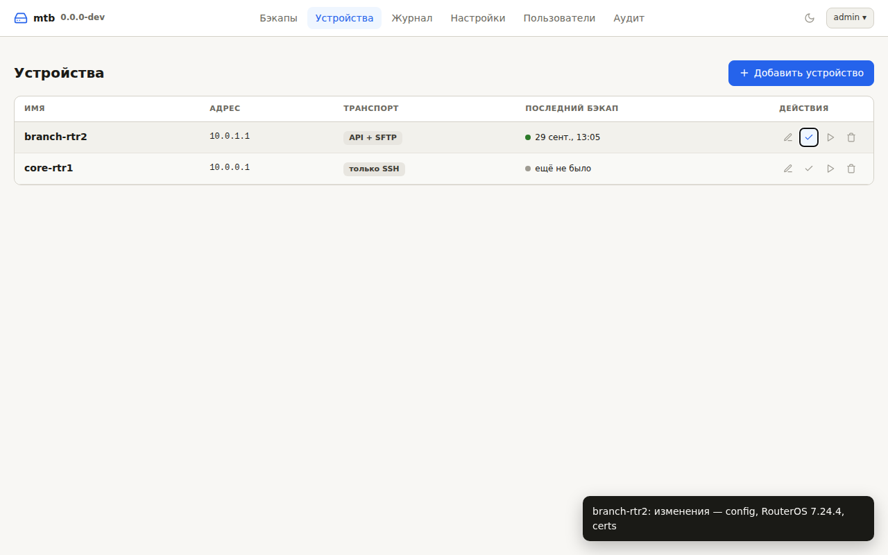
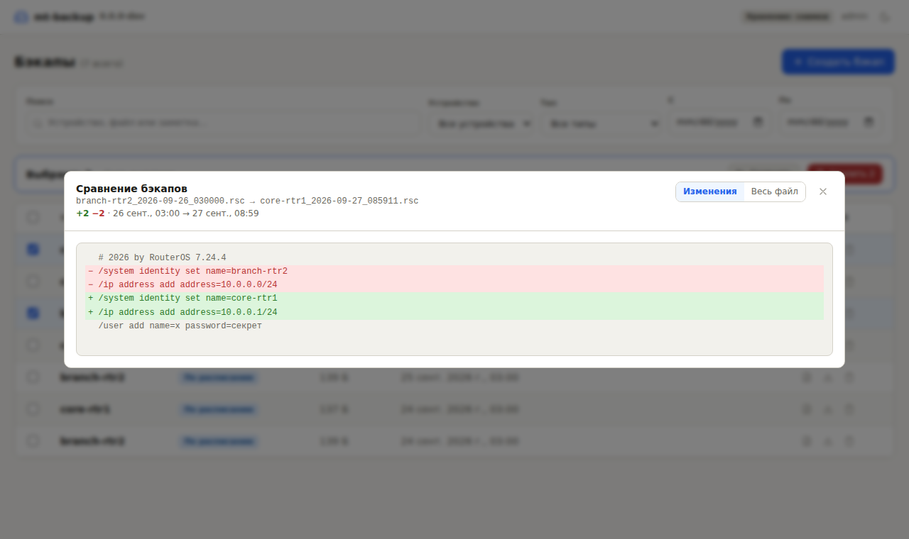

# mtb

[English](README.md) | **Русский**

Сервис для ежедневного резервного копирования MikroTik RouterOS 7 с веб-интерфейсом. Каждый прогон собирает:

- текстовый экспорт конфигурации **с паролями и ключами**;
- зашифрованный бинарный backup;
- сертификаты с приватными ключами.

Вся настройка идёт в браузере: устройства, расписание, хранение, Gitea, Telegram и пользователи. Настройки лежат в SQLite, пароли устройств и токены в базе зашифрованы. Бэкапы складываются в папку с историей изменений (git) или снимками по датам, push в self-hosted Gitea — по желанию.

Устанавливается одним бинарником из GitHub Releases (Linux amd64/arm64, Windows) или через Docker / Docker Compose. Python, база данных и CDN не нужны: работает и в закрытом контуре.



## Возможности

- **Экспорт** `/export show-sensitive terse`: каждая строка — полная команда, диффы читаются удобно.
- **Бинарный** `/system backup save` с паролем — для восстановления «один в один».
- **Сертификаты** с приватным ключом выгружаются в `.p12` или PEM, плюс индекс всех сертификатов.
- **Три транспорта** на выбор для каждого устройства: API-SSL + SFTP, только API-SSL или только SSH. В режиме SSH конфиг читается из вывода `/export`, и на роутере не создаётся файлов.
- **Хранение**: текущее состояние с историей в git или папка-снимок с датой на каждый прогон с ротацией. Push в Gitea — по желанию.
- **Веб-интерфейс**:
  - бэкапы: фильтры, просмотр, сравнение двух копий, ручной бэкап, удаление, восстановление;
  - устройства с проверкой доступа и транспорта;
  - журнал запусков, настройки, пользователи с ролями, аудит.
- **Первый вход:** создаётся пользователь `admin`, пароль вы придумываете при первом входе.
- **Интерфейс на русском и английском**, тема светлая, тёмная или как в системе.
- **Уведомления в Telegram** при ошибках и изменениях.

## Содержание

- [Быстрый старт](#быстрый-старт)
- [Как это работает](#как-это-работает)
- [Что сохраняется](#что-сохраняется)
- [Подготовка MikroTik](#подготовка-mikrotik)
- [Установка](#установка)
- [Веб-интерфейс](#веб-интерфейс)
- [Настройки устройства](#настройки-устройства)
- [Общие настройки](#общие-настройки)
- [Переменные окружения](#переменные-окружения)
- [Режимы транспорта](#режимы-транспорта)
- [Хранение и Gitea](#хранение-и-gitea)
- [Команды](#команды)
- [Переход со старой версии](#переход-со-старой-версии)
- [Восстановление](#восстановление)
- [Безопасность](#безопасность)
- [Резервная копия самого mtb](#резервная-копия-самого-mtb)
- [Обновление](#обновление)
- [Устранение неполадок](#устранение-неполадок)
- [Разработка и сборка](#разработка-и-сборка)

## Быстрый старт

**Docker Compose:**

```bash
mkdir -p mtb/{data,backups} && cd mtb
curl -fsSLO https://raw.githubusercontent.com/netcorexc0a8/mtb/main/docker-compose.yml
PUID=$(id -u) PGID=$(id -g) docker compose up -d
```

**Бинарник под Linux (systemd):**

```bash
curl -fsSL https://github.com/netcorexc0a8/mtb/releases/latest/download/install.sh | sudo sh
```

Дальше:

1. Откройте `http://<сервер>:8080`. Сразу появится форма первого входа: логин `admin`, придумайте пароль и подтвердите его.
2. **Устройства → Добавить устройство:** адрес, пользователь RouterOS, пароль и транспорт. Для API-SSL нажмите «Получить с устройства», чтобы подставить отпечаток сертификата.
3. **Настройки → Хранение:** задайте пароль шифрования бэкапов.
4. **Журнал → Запустить сейчас**, или дождитесь расписания (по умолчанию каждый день в 03:00).



> ⚠️ Пока пароль `admin` не задан, его может задать любой, кто первым откроет страницу. Сделайте это сразу после установки. Если на сервисе опубликован внешний адрес, лучше пройти первый вход через SSH-туннель: `ssh -L 8080:127.0.0.1:8080 server`.

## Как это работает

Для каждого устройства по расписанию:

1. Подключение: по **API-SSL** (8729) с проверкой TLS-сертификата или по **SSH** (22), в зависимости от транспорта.
2. Экспорт конфигурации (`/export show-sensitive terse`), `system backup save` с паролем и выгрузка сертификатов с приватным ключом.
3. Файлы забираются по SFTP или через API `/file/read`. В режиме SSH конфиг берётся прямо из вывода `/export`.
4. Временные файлы `mtbk-*` удаляются с роутера, в том числе при ошибке.
5. Результат записывается в папку бэкапов: git-коммит или снимок. Если настроено, выполняется push в Gitea.
6. Итог попадает в журнал запусков. Если были изменения или ошибки, уходит сообщение в Telegram.

Настройки перечитываются из базы перед каждым прогоном. Изменения из интерфейса, в том числе расписание, применяются без перезапуска.

## Что сохраняется

При хранении **git** (по умолчанию) в папке устройства лежит текущее состояние, а история — в git:

```
backups/
├── core-rtr1/
│   ├── config.rsc          # экспорт с паролями, без строки с датой
│   ├── system.backup       # зашифрован паролем шифрования бэкапов
│   ├── meta.json           # identity и версия RouterOS
│   └── certs/
│       ├── index.json      # все сертификаты: имя, CN, отпечаток, срок
│       └── vpn-server.p12  # или .crt + .key (формат PEM)
└── branch-rtr2/…
```

Правила обновления файлов:

- `config.rsc` перезаписывается только при изменениях: строка заголовка с датой вырезается.
- `system.backup` обновляется вместе с конфигом.
- Сертификаты обновляются, только если изменился их индекс.

`.backup` и `.p12` при каждом экспорте получают новую соль, поэтому ежедневная перезапись раздувала бы историю без реальных изменений.

При хранении **снимками** каждый прогон создаёт папку `<устройство>/<ГГГГ-ММ-ДД_ЧЧММСС>/` со всеми файлами, а старые снимки удаляются ротацией.

При «только конфиг» в обоих режимах нет `system.backup` и `certs/`.

> ⚠️ RouterOS никогда не включает пароли пользователей `/user` в `export`, даже с `show-sensitive`. Они есть только в `system.backup`.

## Подготовка MikroTik

`10.10.10.5` в примерах — адрес сервера mtb.

**1. Сертификат для API-SSL.** Не нужен при транспорте «Только SSH». Ключ должен быть не меньше 2048 бит.

```routeros
/certificate add name=api-ssl common-name=core-rtr1 days-valid=3650 key-size=2048 \
    key-usage=digital-signature,key-encipherment,tls-server
/certificate sign api-ssl
/ip service set api-ssl certificate=api-ssl address=10.10.10.5/32 disabled=no
```

**2. SSH.** Не нужен при транспорте «Только API».

```routeros
/ip service set ssh address=10.10.10.5/32,<ваши адреса управления>
```

**3. Группа и пользователь.**

```routeros
/user group add name=backup policy=read,write,policy,test,sensitive,api,ssh,ftp
/user add name=backup group=backup address=10.10.10.5/32 password="<пароль>"
```

Минимальный набор политик зависит от режима. Кнопка «Проверить доступ» в карточке устройства покажет, каких не хватает. Например, «Только SSH» + «Только конфиг» требует лишь `read,sensitive,ssh`.

| Политика | Зачем нужна |
|---|---|
| `read`, `sensitive` | Экспорт с паролями и ключами. |
| `write`, `ftp` | Создание, чтение и удаление временных файлов. |
| `policy`, `test` | `system backup save`, сертификаты. |
| `api` / `ssh` | Подключение выбранным транспортом. |

**4. Отпечаток сертификата** подставляется кнопкой «Получить с устройства» в форме устройства. Сверьте его с выводом `/certificate print detail` на роутере, чтобы исключить подмену.

## Установка

### Бинарник Linux (systemd)

Бинарник самодостаточен и работает на системах с glibc 2.28 и новее: Debian 10+, Ubuntu 20.04+, Astra Linux 1.7+, RHEL/Alma 8+. Для хранения git и push в Gitea на хосте нужен `git`.

```bash
curl -fsSL https://github.com/netcorexc0a8/mtb/releases/latest/download/install.sh | sudo sh
# конкретная версия:
curl -fsSLO https://github.com/netcorexc0a8/mtb/releases/latest/download/install.sh && sudo sh install.sh v2.0.0
```

Что делает скрипт:

- проверяет бинарник по `SHA256SUMS` и ставит его в `/usr/local/bin/mtb`;
- создаёт системного пользователя `mtb` и папки `/var/lib/mtb/{data,backups}` с правами 0700;
- ставит и запускает `mtb.service`.

Необязательные переменные запуска задаются в `/etc/mtb/mtb.env`. Логи: `journalctl -u mtb -f`.

**Вручную, в любой папке:**

```bash
curl -fsSLo mtb https://github.com/netcorexc0a8/mtb/releases/latest/download/mtb-linux-amd64
chmod +x mtb && ./mtb
```

База и бэкапы создадутся в `./data` и `./backups`.

### Windows

1. Скачайте `mtb-windows-amd64.exe` из [Releases](https://github.com/netcorexc0a8/mtb/releases) и положите в `C:\mtb\`.
2. Для хранения git установите [Git for Windows](https://git-scm.com/download/win) или выберите в настройках хранение снимками.
3. Запустите `mtb-windows-amd64.exe serve` из `C:\mtb` и откройте `http://localhost:8080`.
4. Для постоянной работы оформите запуск как службу, например через NSSM, с рабочей папкой `C:\mtb`.

### Docker Compose

Образ `ghcr.io/netcorexc0a8/mtb` собирается для linux/amd64 и linux/arm64.

```bash
mkdir -p mtb/{data,backups} && cd mtb
curl -fsSLO https://raw.githubusercontent.com/netcorexc0a8/mtb/main/docker-compose.yml
echo "PUID=$(id -u)" > .env && echo "PGID=$(id -g)" >> .env
docker compose up -d && docker compose logs -f
```

| Путь на хосте | В контейнере | Назначение |
|---|---|---|
| `./data` | `/data` | SQLite, ключ шифрования секретов, `known_hosts`. |
| `./backups` | `/backups` | Бэкапы. |

Порт опубликован на `127.0.0.1:8080`. Наружу интерфейс выставляйте через обратный прокси с TLS и задайте `WEB_COOKIE_SECURE=true`. HEALTHCHECK образа опрашивает `/healthz`.

Без compose:

```bash
docker run -d --name mtb --restart unless-stopped --init --user "$(id -u):$(id -g)" \
  -p 127.0.0.1:8080:8080 -v "$PWD/data:/data" -v "$PWD/backups:/backups" \
  ghcr.io/netcorexc0a8/mtb:latest
```

## Веб-интерфейс

| Раздел | Что там | Кому доступно |
|---|---|---|
| **Бэкапы** | Список с фильтрами, просмотр, сравнение двух копий, скачивание любого файла бэкапа, ручной бэкап, удаление, восстановление. | Все: просмотр и скачивание. Администратор: остальное. |
| **Устройства** | Список со статусом последнего бэкапа. Добавление и изменение, проверка доступа, проверка транспортов (`probe`), бэкап сейчас. | Все: список. Администратор: изменения. |
| **Журнал** | История запусков: успешные, с изменениями, ошибки по устройствам. Кнопка «Запустить сейчас». | Все. |
| **Настройки** | Расписание, хранение и шифрование, Gitea, Telegram, восстановление из веба. | Администратор. |
| **Пользователи** | Роли «администратор» и «просмотр», временные пароли. | Администратор. |
| **Аудит** | Входы, изменения настроек и устройств, скачивания, удаления, восстановления. | Администратор. |



**Язык и тема.** Кнопки в шапке и на странице входа:

- **RU / EN** переключает язык интерфейса. Сообщения сервера (ошибки, журнал запусков, результаты проверок) тоже приходят на выбранном языке.
- **Тема** переключается по кругу: как в системе → светлая → тёмная.

Выбор запоминается в браузере. Без сохранённого выбора язык берётся из настроек браузера, а тема следует системной.

**Сравнение бэкапов.** Выберите ровно два и нажмите «Сравнить». Дифф всегда строится от старого к новому. По умолчанию показываются только изменения с контекстом, «Весь файл» раскрывает остальное.



**Пользователи и пароли:**

- При первом запуске создаётся `admin` без пароля. Пароль (не короче 10 символов) задаётся при первом входе, с подтверждением.
- Новым пользователям администратор выдаёт временный пароль. При первом входе пользователь вводит его и придумывает свой.
- Кнопка «Выдать временный пароль» сбрасывает забытый пароль и завершает сессии пользователя.
- Свой пароль меняется в меню пользователя, при этом остальные ваши сессии завершаются.
- Если забыт пароль единственного администратора: `mtb reset-password admin` на сервере. При следующем входе будет предложено задать новый.

## Настройки устройства

Задаются в форме **Устройства → Добавить / Изменить**.

| Поле | По умолчанию | Описание |
|---|---|---|
| Имя | — | Уникальное, латиница, цифры, `. _ -`. Это и имя папки с бэкапами. |
| Адрес, пользователь, пароль | — | Доступ к RouterOS. Пароль хранится зашифрованным и в интерфейс не возвращается. |
| Включено в расписание | да | Выключенные устройства не опрашиваются по расписанию, но их можно забэкапить вручную. |
| Транспорт | API + SFTP | API + SFTP, только API-SSL или только SSH. См. [Режимы транспорта](#режимы-транспорта). |
| Только конфиг | нет | Без `system.backup` и сертификатов. |
| Бинарные файлы через API | base64 | Для «Только API»: `base64`, `raw` или «не забирать». |
| Формат сертификатов | авто | PKCS#12 или PEM. |
| Какие сертификаты | все с ключом | Все, только перечисленные или ни одного. |
| Проверка TLS | отпечаток | Отпечаток SHA-256, свой сертификат или CA в PEM, или «не проверять». Для «Только SSH» не нужна. |
| Слабые ключи | нет | Разрешить сертификаты API-SSL с ключом 1024 бит. |
| Порты, таймаут | 8729, 22, 30 с | |
| Кодировка | UTF-8 | Windows-1251, если имена и комментарии набирались в Winbox по-русски. |

## Общие настройки

Раздел **Настройки**, только для администратора.

| Группа | Параметры |
|---|---|
| Расписание | Cron-выражение (по умолчанию `0 3 * * *`), часовой пояс, сколько устройств опрашивать параллельно. Показывается время следующего запуска. |
| Хранение и шифрование | Пароль шифрования `.backup` и сертификатов. Режим: git или снимки. Для git — вести ли историю. Для снимков — срок хранения, минимум снимков, «только при изменениях». |
| Gitea | URL репозитория, пользователь, токен, ветка, автор коммитов, CA в PEM, отключение проверки TLS. |
| Telegram | Токен бота, `chat_id`, язык уведомлений (русский или английский), кнопка «Отправить тестовое сообщение». |
| Веб-интерфейс | Разрешить восстановление (`/import`) из списка бэкапов. По умолчанию выключено. |

Секреты (пароль шифрования, токены) в интерфейс не возвращаются: видно только «задан» или «не задан». Пустое поле при сохранении оставляет прежнее значение, а галочка «удалить» стирает его.

## Переменные окружения

Нужны только для запуска. Всё остальное настраивается в интерфейсе.

| Переменная | По умолчанию | Описание |
|---|---|---|
| `DATA_DIR` | `data` (Docker: `/data`) | База `mtb.db`, ключ `secret.key`, `known_hosts`. |
| `BACKUP_DIR` | `backups` (Docker: `/backups`) | Папка бэкапов. |
| `WEB_LISTEN` | `0.0.0.0:8080` | Адрес веб-интерфейса. |
| `WEB_TLS_CERT` / `WEB_TLS_KEY` | — | HTTPS без обратного прокси. |
| `WEB_COOKIE_SECURE` | `auto` | Флаг Secure у cookie сессии. `auto` включает его, если задан `WEB_TLS_CERT`. За HTTPS-прокси ставьте `true`. |
| `LOG_LEVEL` | `INFO` | Уровень логирования. |

Их можно задать в окружении, в файле `.env` в рабочей папке или в файле, переданном через `-e`.

## Режимы транспорта

| | API + SFTP (по умолчанию) | Только API | Только SSH |
|---|---|---|---|
| Команды | API-SSL | API-SSL | SSH exec |
| Конфиг | файл → SFTP | файл → `/file/read` | вывод `/export`, без файла |
| `.backup`, сертификаты | SFTP | через `api_binary` | SFTP в той же сессии |
| Порты | 8729 + 22 | только 8729 | только 22 |
| Проверка хоста | TLS + SSH (TOFU) | TLS | SSH (TOFU) |
| RouterOS | любая 7.x | 7.13+ | любая 7.x |

В режиме «Только API» бинарные файлы передаются обходным путём, потому что API оперирует строками:

- **`base64`** — роутер сам кодирует куски файла;
- **`raw`** — сырые байты через соединение в `latin-1`;
- **«не забирать»** — без `.backup`, сертификаты в PEM.

Что работает на конкретном роутере, покажет кнопка **«Проверить транспорты»** в форме устройства (то же, что `mtb probe`). Она создаёт временные файлы, читает их всеми способами, сравнивает с эталоном по SFTP и даёт рекомендацию.

Самый простой режим — «Только SSH» + «Только конфиг»: одна SSH-команда на устройство, на роутере ничего не создаётся, из политик нужны `read,sensitive,ssh`.

## Хранение и Gitea

**Git** (по умолчанию). В папке лежит текущее состояние, а история — в локальном git, так что `git log -p` и `git diff` работают прямо в `backups/`. Отключив «Вести историю», вы оставите только последние файлы.

**Снимки.** Каждый прогон создаёт папку с датой и полной копией всего собранного.

- Снимки старше заданного срока удаляются, но минимум последних остаётся всегда — даже если роутер долго был недоступен.
- «Только при изменениях» создаёт снимок, только если изменились конфиг, версия RouterOS или сертификаты.
- Удалять бэкапы из веба можно только в этом режиме: коммиты git не удаляются.

**Gitea** (только для хранения git):

1. Создайте приватный репозиторий и пользователя с правом записи.
2. Выпустите для него токен: *Настройки → Приложения → Токены доступа*, право `write:repository`.
3. Введите URL, пользователя и токен в **Настройки → Gitea**.

Как устроен push:

- Токен передаётся git через переменные окружения и не попадает в `.git/config`.
- Push выполняется каждый прогон и догоняет неудачные прошлые.
- Ошибка push не считается ошибкой бэкапа: в журнале она отмечается как предупреждение.

## Команды

```
mtb [--data-dir DIR] [-e ENV_FILE] [--log-level LEVEL] [КОМАНДА]

  serve                   расписание + веб-интерфейс (по умолчанию; алиас: daemon)
  scheduler               только расписание, без веб-интерфейса
  run [-d NAME ...]       один прогон и выход; без -d — все включённые устройства
  check [-d NAME ...]     проверка доступа и прав без экспорта
  probe [-d NAME ...] [--no-sftp]
                          какой транспорт файлов работает
  fingerprint HOST[:PORT] отпечаток, срок и PEM сертификата API-SSL
  import-config -c devices.yaml [--replace]
                          перенос конфигурации старой версии
  reset-password [USER]   сбросить пароль (по умолчанию admin)
  -V, --version
```

Команды работают с той же базой, что и сервис: укажите тот же `DATA_DIR`. Под systemd это выглядит так:

```bash
sudo -u mtb env DATA_DIR=/var/lib/mtb/data mtb check
```

В Docker: `docker compose exec mtb mtb check`.

## Переход со старой версии

Версии 1.x настраивались через `devices.yaml` и `.env`. Чтобы перенести их в базу:

```bash
# бинарник / systemd
sudo -u mtb env DATA_DIR=/var/lib/mtb/data \
  mtb -e /старый/.env import-config -c /старый/config/devices.yaml

# Docker: положите старые файлы в ./data/old/ и выполните
docker compose exec mtb mtb -e /data/old/.env import-config -c /data/old/devices.yaml
```

Что переносится:

- **Устройства.** Пароли берутся из `MT_PASSWORD` и `password_env`, а `tls_ca` — содержимым PEM-файла.
- **Общие настройки** из переменных (`SCHEDULE`, `BACKUP_PASSPHRASE`, `STORAGE`, `GITEA_*`, `TELEGRAM_*` и т. д.).

Уже существующие устройства пропускаются, `--replace` их перезаписывает. Папку бэкапов менять не нужно: история git и снимки подхватятся как есть. Старые `WEB_USER` и `WEB_PASSWORD` больше не используются — войдите как `admin` и задайте пароль.

## Восстановление

Все файлы зашифрованы паролем шифрования бэкапов. Загрузить файл на роутер можно через Winbox (*Files*) или по SFTP.

```routeros
# бинарный backup — на то же устройство или ту же модель, роутер перезагрузится
/system backup load name=system.backup password="<пароль шифрования>"

# сертификаты
/certificate import file-name=vpn-server.p12 passphrase="<пароль шифрования>"
/certificate import file-name=vpn-server.crt
/certificate import file-name=vpn-server.key passphrase="<пароль шифрования>"
```

**Текстовый экспорт** на сброшенное или другое устройство:

1. Выполните `/system reset-configuration no-defaults=yes skip-backup=yes`.
2. Подключитесь через Winbox по MAC-адресу.
3. Загрузите файлы сертификатов и `config.rsc`.
4. Сначала импортируйте сертификаты: на них ссылаются `ip service`, IPsec и другие разделы.
5. Выполните `/import file-name=config.rsc`.
6. Задайте пароли `/user` заново.

Если в настройках включено восстановление, кнопка «Восстановить» в списке бэкапов загружает `.rsc` по SSH и выполняет `/import`, а вывод показывается в окне. `/import` применяет скрипт поверх текущей конфигурации, поэтому эта кнопка рассчитана на сброшенное устройство или частичные скрипты.

## Безопасность

- **Бэкапы содержат пароли, PSK и приватные ключи открытым текстом.** Папка бэкапов создаётся с правами 0700, репозиторий в Gitea должен быть приватным.
- **Секреты в базе** (пароли устройств, пароль шифрования, токены) зашифрованы ключом `DATA_DIR/secret.key` (Fernet: AES + HMAC). Ключ создаётся при первом запуске с правами 0600. Без него секреты из базы не прочитать.
- **Пароли пользователей** хранятся как scrypt-хэши.
- **Сессия** хранится в cookie `HttpOnly` + `SameSite=Strict` и живёт 12 часов, продлеваясь при активности.
- **CSRF:** изменяющие запросы требуют заголовок `X-Requested-With`.
- **Перебор паролей:** не больше 10 неудачных попыток за 15 минут с одного адреса.
- **Роли:** «просмотр» не видит настройки, пользователей и аудит и ничего не меняет.
- Строгий CSP, внешних скриптов нет.
- Пароли устройств и токены не отдаются в API, только признак «задан».
- **Аудит** фиксирует входы, неудачные попытки, изменения, скачивания, удаления и восстановления.
- **Наружу — только через HTTPS:** обратный прокси с `WEB_COOKIE_SECURE=true` или `WEB_TLS_CERT` / `WEB_TLS_KEY`.
- **Пользователя `backup` на роутерах** ограничьте адресом, а сервисы — `address=`. Не отключайте проверку TLS: у этой учётки есть права `sensitive` и `write`.
- **SSH-ключ роутера** запоминается при первом подключении. Если ключ потом сменится, подключение будет отклонено.

## Резервная копия самого mtb

Сохраняйте папку `DATA_DIR` целиком: `mtb.db` и `secret.key` **вместе**. Пароль шифрования бэкапов храните отдельно, например в менеджере паролей: без него `.backup` и сертификаты не восстановить.

Для копии «на ходу» используйте `sqlite3 mtb.db ".backup copy.db"` или остановите сервис.

## Обновление

| Способ | Как |
|---|---|
| systemd | `curl -fsSL …/install.sh \| sudo sh` — конфигурация и база не затрагиваются. |
| Docker Compose | `docker compose pull && docker compose up -d` |

Схема базы обновляется автоматически при запуске.

## Устранение неполадок

| Симптом | Решение |
|---|---|
| Забыт пароль `admin` | `mtb reset-password admin` с тем же `DATA_DIR`. При следующем входе будет предложено задать новый. |
| После входа сразу снова форма входа | Интерфейс открыт по HTTP, а `WEB_COOKIE_SECURE=true`. Используйте HTTPS или уберите переменную. |
| «Слишком много попыток» | 10 неудачных входов за 15 минут. Подождите или перезапустите сервис. |
| `не удалось расшифровать секрет` | База скопирована без своего `secret.key`. Верните ключ или задайте пароли заново. |
| `FingerprintMismatch` | Сертификат API-SSL перевыпущен. Нажмите «Получить с устройства» и сверьте отпечаток. |
| `DH_KEY_TOO_SMALL`, `handshake failure` | Ключ API-SSL меньше 2048 бит: перевыпустите или включите «Слабые ключи». |
| Не хватает политик | «Проверить доступ» покажет, каких именно. |
| `BadHostKeyException` | Сменился SSH-ключ роутера. Если это ожидаемо, удалите строку из `DATA_DIR/known_hosts`. |
| `Не задан пароль шифрования` | Настройки → Хранение и шифрование. |
| `UnicodeDecodeError` | Кодировка устройства — Windows-1251. |
| `Permission denied` в `./data` или `./backups` (Docker) | Задайте `PUID` и `PGID` владельца папок. |
| Push отклонён | В репозиторий коммитили вручную. Сервис попробует `pull --rebase`; при конфликте разрешите его в `backups/`. |

Подробный лог: `LOG_LEVEL=DEBUG`.

## Разработка и сборка

```bash
git clone https://github.com/netcorexc0a8/mtb.git && cd mtb
python -m venv .venv && . .venv/bin/activate && pip install -r requirements.txt
python -m mtb serve          # http://localhost:8080, данные в ./data и ./backups
```

**Бинарник:**

```bash
pip install pyinstaller && pyinstaller --clean --noconfirm mtb.spec
```

Для совместимости со старыми glibc собирайте в `python:3.11-slim-buster`, как CI.

**Релиз:** `git tag v2.0.0 && git push origin v2.0.0`. Workflow соберёт бинарники (linux-amd64, linux-arm64, windows-amd64), опубликует образ в GHCR и создаст GitHub Release с `install.sh`, systemd-юнитом и `SHA256SUMS`.

### Структура проекта

```
mtb/
├── mtb/
│   ├── main.py          # CLI и сервис (расписание + веб)
│   ├── config.py        # запуск из окружения, настройки и устройства из SQLite
│   ├── db.py            # SQLite: схема и миграции
│   ├── secretbox.py     # шифрование секретов в базе
│   ├── auth.py          # пользователи, scrypt, сессии, защита от перебора
│   ├── web.py           # веб-сервер и API
│   ├── web/             # index.html, app.js, app.css, i18n.js (английский словарь, тема)
│   ├── i18n.py          # английские переводы сообщений сервера
│   ├── runner.py        # один прогон бэкапа + журнал запусков
│   ├── mikrotik.py      # API-SSL, SSH, SFTP, /file/read, экспорт, восстановление
│   ├── probe.py         # проверка транспортов
│   ├── storage.py       # хранение git / снимки, push в Gitea
│   ├── catalog.py       # индекс бэкапов для веба
│   ├── importer.py      # перенос devices.yaml и .env старой версии
│   └── notify.py        # Telegram
├── packaging/           # точка входа PyInstaller, systemd-юнит
├── docs/                # скриншоты
├── install.sh, mtb.spec, Dockerfile, docker-compose.yml, .env.example
├── README.md            # English
├── README.ru.md         # русский (основной)
└── .github/workflows/release.yml
```
